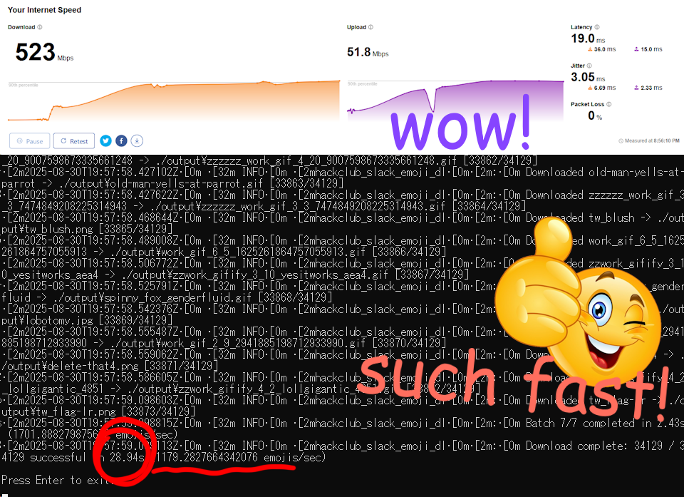
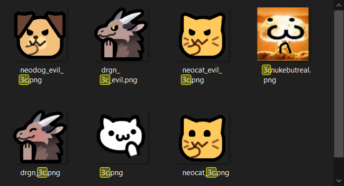

# Hack Club Slack Emoji Downloader

CLI tool for fetching and downloading all emojis currently in Hack Club's Slack workspace (source: https://badger.hackclub.dev/api/emoji).

Built in Rust.

**⚠️ Note: Download performance is bottlenecked by your network speeds.**

This is my first Rust project. Roast my poor programming conventions all you want <3.

# Features

- Batch processing with concurrent (parallel) downloads to maximise throughput
- Automatic retries if a download fails
- It's pretty damn fast TwT

## Usage

`hackclub-slack-emoji-dl [OPTIONS]`

### Options

- `--output-dir <PATH>`: Directory to save emojis (default: "./output")
- `--concurrent <NUMBER>`: Maximum concurrent downloads (default: 500)
- `--batch-size <NUMBER>`: Number of emojis to process in each batch (default: 5000)
- `--skip-existence-check`: Skip checking if files already exist
- `--api-url <URL>`: Custom API endpoint (default: "https://badger.hackclub.dev/api/emoji")
- `-h, --help`: Display help information

### Building

`cargo build --release`